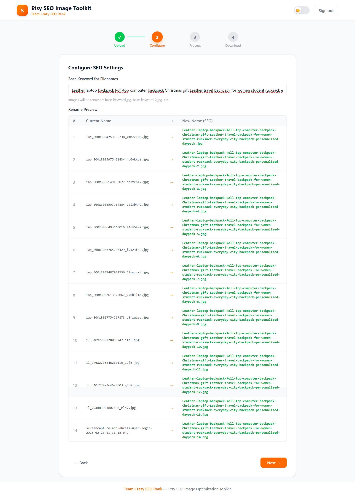
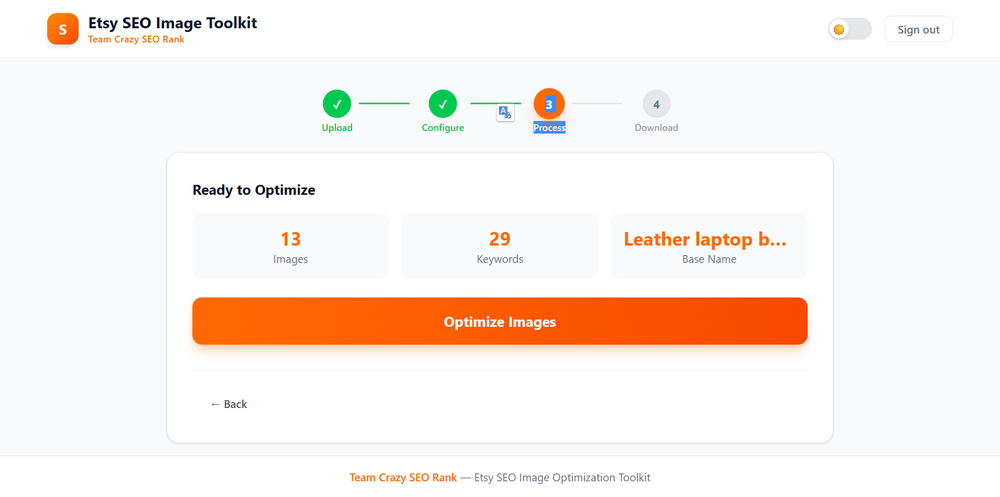
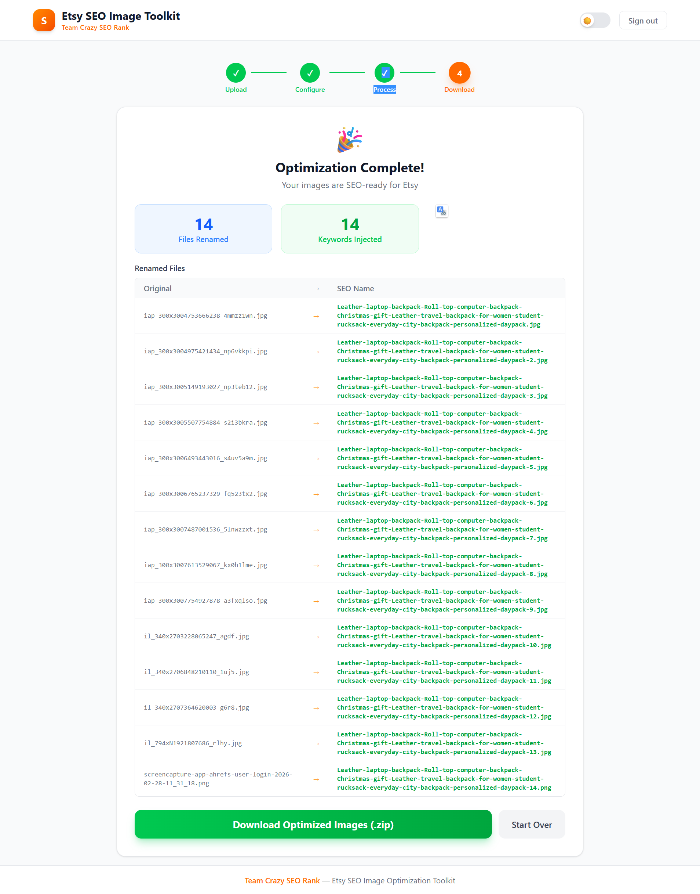

# Etsy SEO Image Toolkit

**By Aamir El Amiri**

A full-stack web application that optimizes your Etsy product images for SEO. It renames image files with keyword-rich names and injects SEO keywords directly into image metadata (EXIF & PNG) — helping your listings rank higher in Etsy search.

---

## Screenshots

### Step 1 — Upload Images & Keywords


### Step 2 — Configure SEO Settings


### Step 3 — Process


### Step 4 — Download Results


---

## What It Does

| Feature | Description |
|---------|-------------|
| SEO Image Renaming | Renames files like `IMG_001.jpg` to `Leather-laptop-backpack.jpg` |
| EXIF Keyword Injection | Writes keywords into JPEG metadata (ImageDescription, XPKeywords, UserComment) |
| PNG Keyword Injection | Adds keyword text chunks to PNG metadata |
| Bulk Processing | Process up to 50 images at once |
| ZIP Download | Download all optimized images as a single ZIP file |
| Dark / Light Mode | Toggle between dark and light themes |

---

## Tech Stack

| Layer | Technology |
|-------|-----------|
| Backend | Python 3.13, FastAPI, Uvicorn, Pillow, piexif |
| Frontend | React 18, Vite, Tailwind CSS, Axios, React Dropzone |
| Containerization | Docker, Docker Compose |

---

## Project Structure

```
SEO-Injecter/
├── backend/                    # FastAPI REST API
│   ├── main.py                 # App entry point
│   ├── requirements.txt        # Python dependencies
│   ├── .env                    # Environment variables (not in git)
│   ├── .env.example            # Template for .env
│   ├── Dockerfile
│   └── app/
│       ├── config.py           # Settings loaded from .env
│       ├── routers/
│       │   ├── images.py       # Upload, rename, inject, download
│       │   └── keywords.py     # Keyword file/text upload
│       ├── services/
│       │   ├── renamer.py      # Image rename logic
│       │   ├── injector.py     # EXIF/PNG keyword injection
│       │   ├── session_manager.py
│       │   └── zipper.py       # ZIP creation
│       ├── models/
│       │   └── schemas.py      # Request/response models
│       └── utils/
│           └── file_utils.py   # Validation helpers
│
├── frontend/                   # React + Tailwind UI
│   ├── index.html
│   ├── package.json
│   ├── vite.config.js
│   ├── .env                    # Frontend env (not in git)
│   ├── .env.example
│   ├── Dockerfile
│   └── src/
│       ├── App.jsx             # Main app with step wizard
│       ├── main.jsx            # Entry point
│       ├── index.css           # Tailwind styles
│       ├── api/                # Axios API client
│       ├── components/         # All UI components
│       ├── context/            # Global state (AppContext)
│       └── hooks/              # useTheme hook
│
├── legacy/                     # Original CLI scripts (reference)
│   ├── code.py
│   ├── injector.py
│   └── keywords.txt
│
├── docker-compose.yml
├── .gitignore
└── README.md
```

---

## Prerequisites

Before you start, make sure you have these installed on your computer:

### 1. Python (version 3.10 or higher)

Download from: https://www.python.org/downloads/

After installing, open a terminal and verify:

```bash
python --version
```

You should see something like `Python 3.13.x`.

### 2. Node.js (version 18 or higher)

Download from: https://nodejs.org/

After installing, verify:

```bash
node --version
npm --version
```

### 3. Git (optional, for cloning)

Download from: https://git-scm.com/downloads

---

## Installation — Step by Step

### Step 1: Get the project

If you have the project folder already, open a terminal and navigate to it:

```bash
cd "Etsy Store"
```

Or if cloning from Git:

```bash
git clone https://github.com/ISTIFANO/SEO-Injecter.git
cd SEO-Injecter
```

### Step 2: Set up the backend

```bash
cd backend
```

Install Python dependencies:

```bash
pip install -r requirements.txt
```

Create your `.env` file (copy from example):

```bash
cp .env.example .env
```

### Step 3: Set up the frontend

Open a **new terminal** and run:

```bash
cd frontend
```

Install Node.js dependencies:

```bash
npm install
```

Create your `.env` file:

```bash
cp .env.example .env
```

---

## Running the App

You need **two terminals** — one for the backend, one for the frontend.

### Terminal 1 — Start the Backend

```bash
cd backend
uvicorn main:app --reload --host 127.0.0.1 --port 8000
```

You should see:

```
INFO:     Uvicorn running on http://127.0.0.1:8000
INFO:     Started reloader process
```

### Terminal 2 — Start the Frontend

```bash
cd frontend
npm run dev
```

You should see:

```
VITE v7.x.x  ready in XXX ms

  ➜  Local:   http://localhost:5173/
```

### Open the App

Open your browser and go to:

```
http://localhost:5173
```

The app opens directly — no login required.

---

## How to Use

### 1. Upload Images
- Drag and drop your product images (JPG, JPEG, PNG) into the upload zone
- Or click "browse" to select files from your computer
- Upload your keywords file (.txt, one keyword per line) or type them manually

### 2. Configure
- Enter a base keyword for filenames (e.g., `Leather-laptop-backpack`)
- See a live preview of how files will be renamed

### 3. Process
- Review the summary (image count, keyword count, base name)
- Click **"Optimize Images"** to rename files and inject keywords

### 4. Download
- See the results summary (files renamed, keywords injected)
- Click **"Download Optimized Images (.zip)"** to get your files
- Click **"Start Over"** to process a new batch

---

## Running with Docker (Optional)

If you have Docker installed, you can run both services with one command:

```bash
docker-compose up --build
```

This starts:
- Backend on http://localhost:8000
- Frontend on http://localhost:5173

To stop:

```bash
docker-compose down
```

---

## API Endpoints

| Method | Endpoint | Description |
|--------|----------|-------------|
| POST | `/api/upload-images` | Upload image files |
| POST | `/api/upload-keyword-file` | Upload .txt keyword file |
| POST | `/api/upload-keywords-text` | Submit keywords as text |
| GET | `/api/rename-preview` | Preview renamed filenames |
| POST | `/api/rename-images` | Execute bulk rename |
| POST | `/api/inject-keywords` | Inject keywords into metadata |
| GET | `/api/download-results` | Download processed images as ZIP |
| GET | `/api/health` | Health check |

Full interactive API docs available at: http://localhost:8000/docs

---

## Environment Variables

### Backend (`backend/.env`)

| Variable | Default | Description |
|----------|---------|-------------|
| `HOST` | `127.0.0.1` | Server host |
| `PORT` | `8000` | Server port |
| `LOG_LEVEL` | `info` | Logging level |
| `MAX_FILE_SIZE_MB` | `10` | Max upload file size in MB |
| `MAX_FILES_PER_UPLOAD` | `50` | Max files per upload |
| `SESSION_EXPIRY_MINUTES` | `60` | Session cleanup time |

### Frontend (`frontend/.env`)

| Variable | Default | Description |
|----------|---------|-------------|
| `VITE_API_URL` | `http://localhost:8000/api` | Backend API URL |

---

## Troubleshooting

### "Port 8000 already in use"
Another process is using the port. Kill it:

```bash
# Windows
netstat -ano | findstr :8000
taskkill /F /PID <PID_NUMBER>

# Mac/Linux
lsof -i :8000
kill -9 <PID>
```

### "Module not found" errors (backend)
Make sure you installed dependencies:

```bash
cd backend
pip install -r requirements.txt
```

### "npm ERR!" errors (frontend)
Delete `node_modules` and reinstall:

```bash
cd frontend
rm -rf node_modules
npm install
```

---

## Author

**Aamir El Amiri** — aamirelamiri3@gmail.com

- GitHub: [github.com/ISTIFANO](https://github.com/ISTIFANO)
- Instagram: [instagram.com/aamir_el_amiri](https://www.instagram.com/aamir_el_amiri/)
- Discord: `aamirelamiri202`

---

## License

This project is proprietary software by **Aamir El Amiri**.
# SEO-Image-Toolkit
